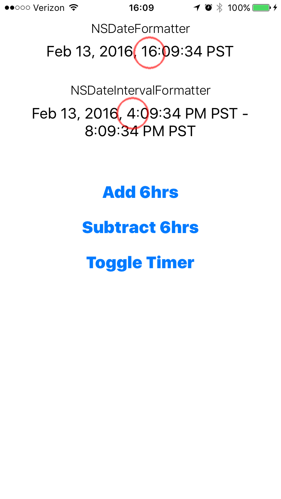

# NSDateIntervalFormatterBug
Demonstrates a bug with the NSDateIntervalFormatter
- must use actual device (not simulator)
- set device to locale that uses AM/PM style
- toggle 24hr format to on
- notice the NSDateFormatter shows time in 24hr format, NSDateIntervalFormatter does not

